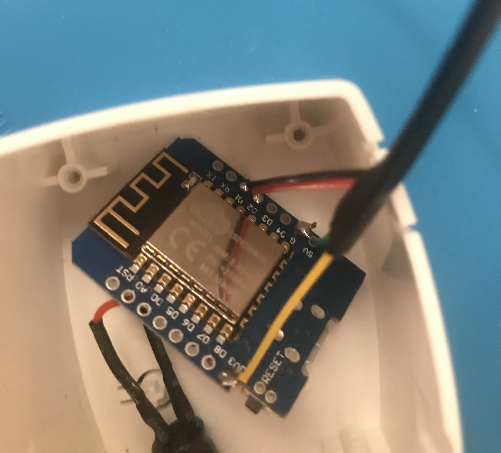
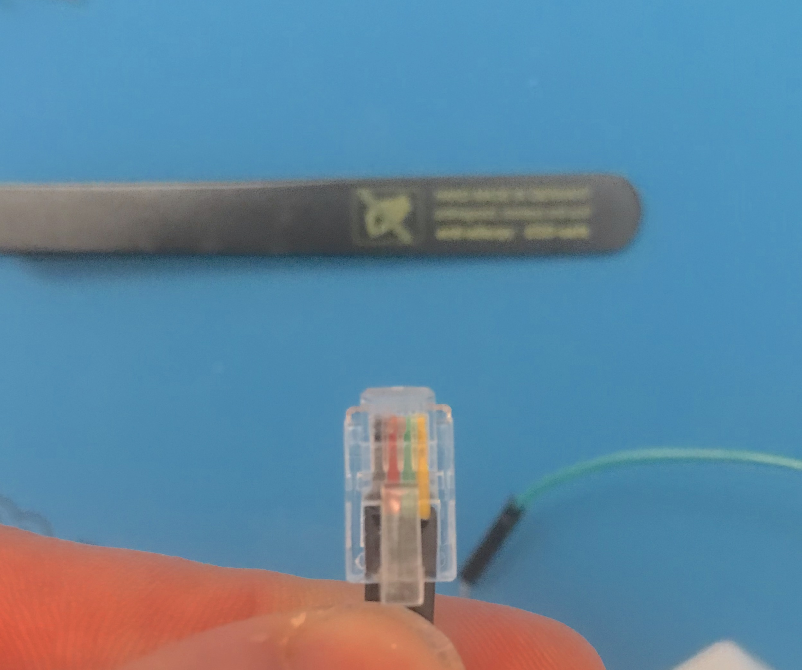

# AQARA-Curtain-with-esp-tasmota
making AQARA-ZNCLDJ11LM Curtain motor work with esp, tasmota and mqtt

## Intro

I was happy with the AQARA Curtain motor since I got it. It enabled me to use my curtain very comfortably and also integrate it into my home automations to realize nice things like "opening the curtains when my alarm goes off in the morning".
Unfortunately I had to realize that the Zigbee-Controler that came with the motor seemed somewhat unreliably. 
Don't know if its caused by my different Zigbee components in the network, 
thick walls or something else, but after some while the curtain stoped responding and needed to be powercycled.
Caused by that anyence I started looking for an solution. I stumbled upon [this repo](https://github.com/HomeACcessoryKid/AQARA-ZNCLDJ11LM) which gave me hope.

The plan was born to replace the Zigbee-Controller by an esp8266.

### The "but"
So far so good. I already did have esp based devices in my smart home but all of them are running [tasmota](https://github.com/arendst/Tasmota). 
I quite like tasmota, which seems robust and versatile to me. So i did want to use the curtain with tasmota, and not homekit.

## Hardware
The Hardware part was straight forward. 
I bought a d1 mini board, a RJ10 cable and used a capacitor that was lying around (I guess its not realy needed).

The Capacitor got soldert between GND and 3,3V of the d1 mini pins.
After that the ends of the RJ10 cable got connected to GND, 3V3, D1 and D2.

The Pins in the RJ10 connector have the following Connections:
 - Black  -> RX (D1)
 - Red    -> TX (D2)
 - Green  -> GND
 - Yellow -> 3,3 V
 
 (D1 and D2 are normal GPIO Pins. The serial interface will later be done in software)

  

